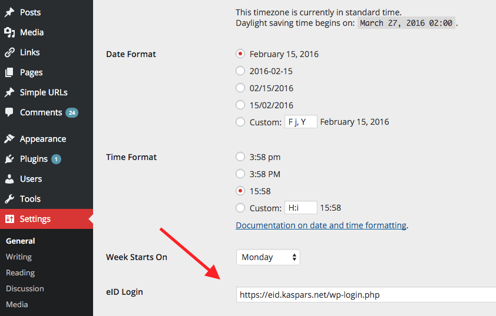
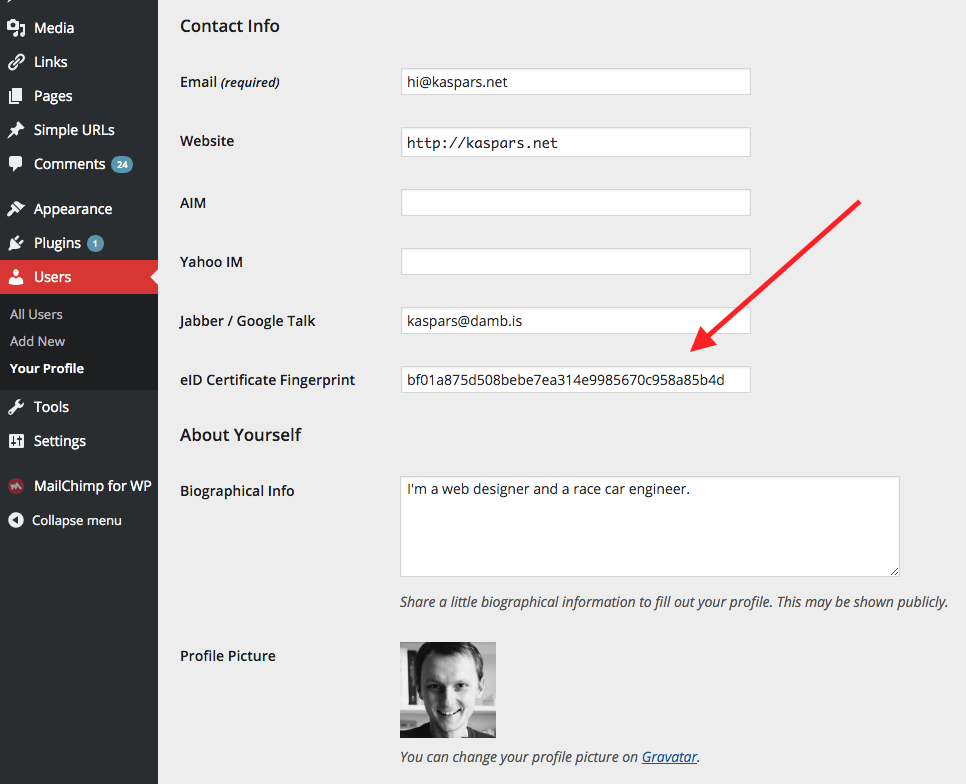

# eID (Client Side Certificate) Login for WordPress

Contributors: kasparsd   
Tags: authentication, ssl, certificate, login, eid   
Requires at least: 4.0   
Tested up to: 4.4   
Stable tag: trunk  

A helper plugin to login using Client Side Certificates, including European identity cards (eID, EstEID, beID, etc.).

## Description

## Installation

Extract the zip file and just drop the contents in the wp-content/plugins/ directory of your WordPress installation and then activate the Plugin from Plugins page.

## Screenshots

1. eID Login URL setting
2. User certificate fingerprint

## Changelog

### 0.1 (February 15, 2016)

- First release.
